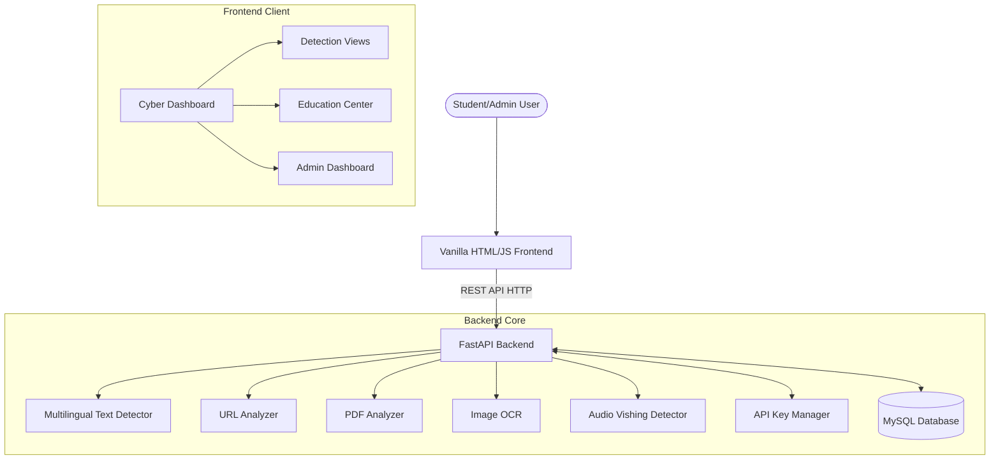

# System Architecture

CyberShield-EDU is a modern web application built with a decoupled frontend-backend architecture.

## High-Level Architecture

## 1. Frontend (Client-Side)
The frontend is a premium, responsive interface built with Vanilla HTML5, CSS3, and JavaScript.
* **Structure**: Modular HTML templates for different views (Detection, Education, Admin).
* **Styling**: Vanilla CSS with a custom "Glassmorphism" design system and multi-theme (Light/Dark) support.
* **State Management**: Local JavaScript variables and `localStorage` to persist recent scans and user preferences.
* **Data Fetching**: Standard `fetch` API and Axios for communication with the FastAPI backend.
* **Navigation**: Direct page-to-page navigation with shared header/footer components for a consistent experience.
* **Data Visualization**: Integrated CSS-based charts and lightweight JS libraries for system statistics in the Admin Panel.

## 2. Backend (Server-Side)
The backend is a high-performance Python server capable of handling asynchronous requests and machine learning inference.
* **Framework**: FastAPI provides asynchronous request handling, automatic OpenAPI (`/docs`) generation, and robust data validation with Pydantic.
* **Text Processing (AI)**:
  - Uses `distilbert-base-multilingual-cased` to support international student protection.
  - **Context Engine**: Implements a role-action conflict matrix to identify high-probability social engineering (e.g., Role: "Faculty" -> Action: "Request OTP").
* **Vision & Audio Scanning**:
  - `pytesseract` extracts text from image screenshots for multi-modal analysis.
  - **Audio Engine**: Transcribes voice notes and scans transcriptions for vishing keywords and bank fraud patterns.
* **URL Heuristics**:
  * Utilizes `python-levenshtein` to compute string distances to detect domain typosquatting against known safe brands.
  * Implements Shannon entropy calculations to identify machine-generated or obfuscated URLs.
* **Data Storage**:
  - **Relational Database**: Uses MySQL (via SQLAlchemy) to store user accounts, API keys (hashed), and permanent scan logs.
  - **API Key Infrastructure**: Secures the public developer endpoints using a hashed-key validation layer.
