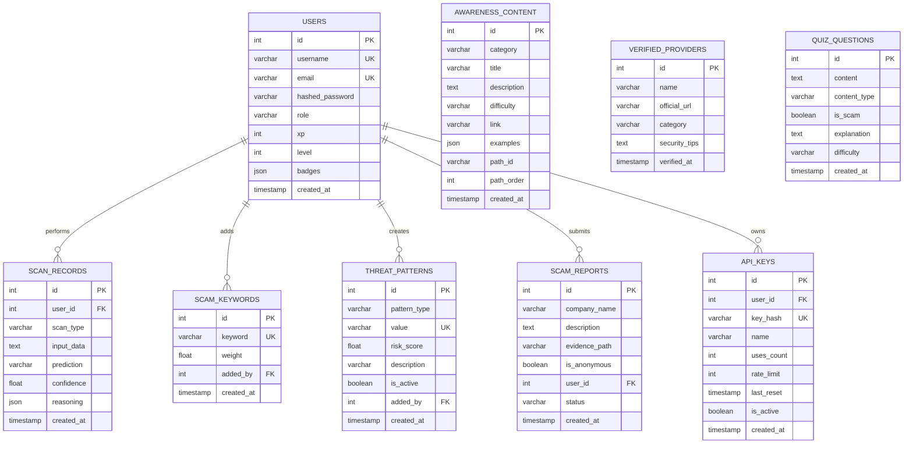
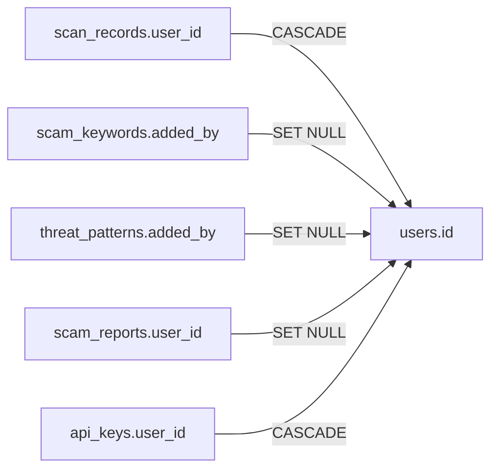

# Database Schema Documentation — CyberShield-EDU

> Complete reference for the CyberShield-EDU relational database schema, including Entity-Relationship diagrams, detailed table specifications, column definitions, indexing strategies, foreign key relationships, data type rationale, and seed data documentation.

---

## Table of Contents

1. [Database Overview](#1-database-overview)
2. [Entity-Relationship Diagram](#2-entity-relationship-diagram)
3. [Table Specifications](#3-table-specifications)
4. [Foreign Key Relationships](#4-foreign-key-relationships)
5. [Indexing Strategy](#5-indexing-strategy)
6. [Data Type Rationale](#6-data-type-rationale)
7. [Seed Data Reference](#7-seed-data-reference)
8. [ORM Mapping](#8-orm-mapping)
9. [Migration Notes](#9-migration-notes)

---

## 1. Database Overview

| Property | Value |
|:---|:---|
| **Engine** | MySQL 8.0+ / MariaDB 10.5+ (via XAMPP) |
| **Character Set** | `utf8mb4` (full Unicode support including emojis) |
| **Collation** | `utf8mb4_general_ci` (case-insensitive) |
| **ORM** | SQLAlchemy 2.0+ with `pymysql` driver |
| **Connection String** | `mysql+pymysql://root@127.0.0.1/cybershield` |
| **Total Tables** | 9 |
| **Schema File** | `backend/app/models/schema.py` |
| **SQL Setup** | `backend/setup_xampp.sql` |

---

## 2. Entity-Relationship Diagram



---

## 3. Table Specifications

### 3.1. `users` — User Accounts & Gamification State

The central identity table that stores both authentication credentials and persistent gamification progress.

| Column | Type | Constraints | Default | Description |
|:---|:---|:---|:---|:---|
| `id` | `INT` | PK, AUTO_INCREMENT, INDEXED | — | Unique user identifier |
| `username` | `VARCHAR(50)` | UNIQUE, NOT NULL, INDEXED | — | Login name and display name |
| `email` | `VARCHAR(100)` | UNIQUE, NOT NULL, INDEXED | — | User email address |
| `hashed_password` | `VARCHAR(255)` | NOT NULL | — | PBKDF2-SHA256 hashed password |
| `role` | `VARCHAR(20)` | — | `'student'` | Access level: `student` or `admin` |
| `xp` | `INT` | — | `0` | Total accumulated Experience Points |
| `level` | `INT` | — | `1` | Current level: `(xp // 100) + 1` |
| `badges` | `JSON` | — | `[]` | Array of earned badge names |
| `created_at` | `TIMESTAMP` | — | `CURRENT_TIMESTAMP` | Account creation time |

**Design Decisions:**
- **Why `badges` is JSON:** Badges are a variable-length, unstructured list of string names. A JSON column avoids the need for a separate `user_badges` junction table, simplifying queries for a feature that only reads/appends.
- **Why `role` is VARCHAR(20):** Keeps RBAC simple with two roles. If more roles are needed, this can be expanded without schema migration.
- **Why gamification lives on `users`:** XP, level, and badges are tightly coupled to user identity and accessed on every authenticated request. Storing them on the same row eliminates JOIN overhead.

---

### 3.2. `scan_records` — Detection Audit Trail

Stores the complete history of every analysis performed on the platform, providing audit capability and enabling future analytics.

| Column | Type | Constraints | Default | Description |
|:---|:---|:---|:---|:---|
| `id` | `INT` | PK, AUTO_INCREMENT, INDEXED | — | Unique scan identifier |
| `user_id` | `INT` | FK → `users.id`, NULLABLE, INDEXED | — | Owner (NULL for guest scans) |
| `scan_type` | `VARCHAR(20)` | NOT NULL | — | Type: `text`, `url`, `pdf`, `image` |
| `input_data` | `TEXT` | — | — | Original input (message, URL, filename) |
| `prediction` | `VARCHAR(20)` | — | — | Verdict: `scam` or `safe` |
| `confidence` | `FLOAT` | — | — | AI confidence score (0.0 - 1.0) |
| `reasoning` | `JSON` | — | — | Array of human-readable reasoning strings |
| `created_at` | `TIMESTAMP` | — | `CURRENT_TIMESTAMP` | Scan timestamp |

**Design Decisions:**
- **Why `user_id` is NULLABLE:** Supports guest scanning (detection works without authentication). The scan is recorded but not linked to any user.
- **Why `reasoning` is JSON:** Reasoning is a variable-length list of strings generated by the detection pipeline. JSON preserves the ordered list structure without needing a separate `scan_reasons` table.
- **Foreign Key Cascade:** `ON DELETE CASCADE` — when a user is deleted, their scan history is also removed.

---

### 3.3. `scam_keywords` — Heuristic Keyword Library

Stores individual scam-indicative keywords used by the Pattern Engine and Text Detector for heuristic matching.

| Column | Type | Constraints | Default | Description |
|:---|:---|:---|:---|:---|
| `id` | `INT` | PK, AUTO_INCREMENT, INDEXED | — | Unique keyword identifier |
| `keyword` | `VARCHAR(100)` | UNIQUE, NOT NULL, INDEXED | — | The scam keyword string |
| `weight` | `FLOAT` | — | `0.1` | Risk weight (impact on confidence score) |
| `added_by` | `INT` | FK → `users.id`, NULLABLE | — | Admin who added this keyword |
| `created_at` | `TIMESTAMP` | — | `CURRENT_TIMESTAMP` | Creation timestamp |

**Design Decisions:**
- **Separate from `threat_patterns`:** Keywords have a simpler schema (no pattern_type, no active/inactive toggle). They serve a different purpose: direct string matching vs. regex/structural patterns.
- **`weight` column:** Allows administrators to assign different risk impacts to different keywords. "Registration fee" (0.2) is stronger than "congratulations" (0.05).
- **Foreign Key On Delete:** `ON DELETE SET NULL` — if the admin user is deleted, the keyword persists with `added_by = NULL`.

---

### 3.4. `threat_patterns` — Dynamic Pattern Engine Rules

The Pillar 2 Pattern Engine's rule storage. Supports four distinct pattern types for extensible heuristic detection.

| Column | Type | Constraints | Default | Description |
|:---|:---|:---|:---|:---|
| `id` | `INT` | PK, AUTO_INCREMENT, INDEXED | — | Unique pattern identifier |
| `pattern_type` | `VARCHAR(20)` | NOT NULL, INDEXED | — | Type: `keyword`, `regex`, `tld`, `domain` |
| `value` | `VARCHAR(500)` | UNIQUE, NOT NULL, INDEXED | — | The actual pattern string |
| `risk_score` | `FLOAT` | — | `0.2` | Impact on 0.0-1.0 risk scale |
| `description` | `VARCHAR(255)` | NULLABLE | — | Human-readable description of what this pattern catches |
| `is_active` | `BOOLEAN` | — | `TRUE` | Active/inactive toggle (soft delete) |
| `added_by` | `INT` | FK → `users.id`, NULLABLE | — | Admin who created this pattern |
| `created_at` | `TIMESTAMP` | — | `CURRENT_TIMESTAMP` | Creation timestamp |

**Pattern Type Reference:**
| Type | Value Example | Matching Logic |
|:---|:---|:---|
| `keyword` | `"registration fee"` | Case-insensitive substring search in text |
| `regex` | `\b(pay\|send)\s+now\b` | Python `re` compiled regex pattern |
| `tld` | `.xyz` | Top-level domain exact match on URLs |
| `domain` | `scam-portal.com` | Exact domain blacklist match |

**Design Decisions:**
- **`is_active` toggle:** Allows administrators to disable a pattern without deleting it, preserving audit history and enabling quick re-activation.
- **Auto-generated by SQLAlchemy:** This table is NOT in `setup_xampp.sql`. It is created automatically by SQLAlchemy's `Base.metadata.create_all()` on first backend startup.
- **In-memory cache:** Active patterns are loaded from the database into the PatternService's in-memory cache on first access. Admin updates trigger cache invalidation.

---

### 3.5. `awareness_content` — Educational Module Library

Stores structured educational content for the academy, organized into learning paths with progressive difficulty.

| Column | Type | Constraints | Default | Description |
|:---|:---|:---|:---|:---|
| `id` | `INT` | PK, AUTO_INCREMENT, INDEXED | — | Unique content identifier |
| `category` | `VARCHAR(50)` | — | — | Category: `Threat Type`, `Pro Tip` |
| `title` | `VARCHAR(255)` | NOT NULL | — | Content title |
| `description` | `TEXT` | — | — | Detailed educational text |
| `difficulty` | `VARCHAR(20)` | — | — | Difficulty: `Beginner`, `Easy`, `Intermediate` |
| `link` | `VARCHAR(500)` | — | — | External resource link |
| `examples` | `JSON` | — | — | Array of example strings (red flags) |
| `path_id` | `VARCHAR(50)` | NULLABLE | — | Learning path identifier (e.g., `scam-0`, `tip-1`) |
| `path_order` | `INT` | — | `0` | Ordering within a learning path |
| `created_at` | `TIMESTAMP` | — | `CURRENT_TIMESTAMP` | Creation timestamp |

**Design Decisions:**
- **`path_id` + `path_order`:** Enables structured learning paths where content is consumed in sequence. Multiple entries can share a `path_id` prefix (e.g., `scam-0`, `scam-1`) to form a course.
- **`examples` as JSON:** Stores a variable-length list of red flag examples. These are rendered as bullet points in the frontend education UI.

---

### 3.6. `verified_providers` — Shield of Trust Whitelist

The Pillar 3 Trust Engine's whitelist database, storing verified legitimate organizations and their official domains.

| Column | Type | Constraints | Default | Description |
|:---|:---|:---|:---|:---|
| `id` | `INT` | PK, AUTO_INCREMENT, INDEXED | — | Unique provider identifier |
| `name` | `VARCHAR(255)` | NOT NULL, INDEXED | — | Organization display name |
| `official_url` | `VARCHAR(500)` | — | — | Verified official website URL |
| `category` | `VARCHAR(50)` | — | — | Category: `Internship`, `Scholarship` |
| `security_tips` | `TEXT` | — | — | Security advice specific to this provider |
| `verified_at` | `TIMESTAMP` | — | `CURRENT_TIMESTAMP` | Verification timestamp |

**Usage:** When a URL scan targets a domain, the TrustService queries this table. If the domain matches a verified provider's `official_url`, the scan result includes a "Shield of Trust" badge and the provider's security tips.

---

### 3.7. `quiz_questions` — Interactive Challenge Library

Stores the "Spot the Scam" quiz questions with realistic scenarios and educational explanations.

| Column | Type | Constraints | Default | Description |
|:---|:---|:---|:---|:---|
| `id` | `INT` | PK, AUTO_INCREMENT, INDEXED | — | Unique question identifier |
| `content` | `TEXT` | NOT NULL | — | The scenario text or image URL |
| `content_type` | `VARCHAR(20)` | — | `'text'` | Input type: `text` or `image` |
| `is_scam` | `BOOLEAN` | — | — | Correct answer: `TRUE` = scam, `FALSE` = safe |
| `explanation` | `TEXT` | — | — | Educational explanation shown after answering |
| `difficulty` | `VARCHAR(20)` | — | — | Difficulty level |
| `created_at` | `TIMESTAMP` | — | `CURRENT_TIMESTAMP` | Creation timestamp |

**Query Note:** The quiz API retrieves questions using `ORDER BY RAND()` with a `LIMIT` parameter, ensuring each quiz session presents a randomized selection.

---

### 3.8. `scam_reports` — Community Reporting

Stores user-submitted scam reports with optional evidence file references. Supports anonymous reporting.

| Column | Type | Constraints | Default | Description |
|:---|:---|:---|:---|:---|
| `id` | `INT` | PK, AUTO_INCREMENT, INDEXED | — | Unique report identifier |
| `company_name` | `VARCHAR(255)` | INDEXED | — | Name of the fraudulent entity |
| `description` | `TEXT` | — | — | Detailed scam description |
| `evidence_path` | `VARCHAR(500)` | NULLABLE | — | Filesystem path to uploaded evidence file |
| `is_anonymous` | `BOOLEAN` | — | `TRUE` | Whether the report is anonymous |
| `user_id` | `INT` | FK → `users.id`, NULLABLE | — | Reporter's user ID (NULL if anonymous) |
| `status` | `VARCHAR(20)` | — | `'pending'` | Review status: `pending`, `reviewed`, `resolved` |
| `created_at` | `TIMESTAMP` | — | `CURRENT_TIMESTAMP` | Submission timestamp |

**Design Decisions:**
- **`is_anonymous` + `user_id`:** A logged-in user can still submit anonymously (`is_anonymous = true`, `user_id = null`). This encourages reporting without fear of identification.
- **`evidence_path`:** Stores a relative filesystem path pointing to `uploads/reports/`. Evidence files are stored outside the database for storage efficiency.
- **`status` workflow:** `pending` → `reviewed` → `resolved` tracks the admin review lifecycle.

---

### 3.9. `api_keys` — Developer API Access Management

Manages developer API keys with usage tracking and rate limiting.

| Column | Type | Constraints | Default | Description |
|:---|:---|:---|:---|:---|
| `id` | `INT` | PK, AUTO_INCREMENT, INDEXED | — | Unique key identifier |
| `user_id` | `INT` | FK → `users.id`, INDEXED | — | Key owner |
| `key_hash` | `VARCHAR(255)` | UNIQUE, NOT NULL, INDEXED | — | SHA-256 hash of the actual API key |
| `name` | `VARCHAR(100)` | — | — | Human-readable key name/description |
| `uses_count` | `INT` | — | `0` | Requests consumed today |
| `rate_limit` | `INT` | — | `1000` | Maximum requests per 24-hour period |
| `last_reset` | `TIMESTAMP` | — | `CURRENT_TIMESTAMP` | Last daily counter reset time |
| `is_active` | `BOOLEAN` | — | `TRUE` | Key active/revoked toggle |
| `created_at` | `TIMESTAMP` | — | `CURRENT_TIMESTAMP` | Key creation timestamp |

**Security Note:** The raw API key is shown to the user exactly once during generation. Only the SHA-256 hash is stored in the database. Authentication works by hashing the incoming `X-API-Key` header and comparing against `key_hash`.

---

## 4. Foreign Key Relationships



| Child Table | Column | Parent Table | Column | On Delete |
|:---|:---|:---|:---|:---|
| `scan_records` | `user_id` | `users` | `id` | **CASCADE** — User deletion removes scan history |
| `scam_keywords` | `added_by` | `users` | `id` | **SET NULL** — Keywords persist after admin deletion |
| `threat_patterns` | `added_by` | `users` | `id` | **SET NULL** — Patterns persist after admin deletion |
| `scam_reports` | `user_id` | `users` | `id` | **SET NULL** — Reports persist after user deletion |
| `api_keys` | `user_id` | `users` | `id` | **CASCADE** — User deletion revokes all their API keys |

**Rationale:** Detection configuration (keywords, patterns) and community data (reports) use SET NULL to preserve institutional knowledge even when the contributing admin leaves. User-personal data (scan history, API keys) uses CASCADE for clean deletion.

---

## 5. Indexing Strategy

| Table | Indexed Columns | Index Type | Purpose |
|:---|:---|:---|:---|
| `users` | `id` | PRIMARY | Row lookups |
| `users` | `username` | UNIQUE | Login query: `WHERE username = ?` |
| `users` | `email` | UNIQUE | Registration duplicate check |
| `scan_records` | `id` | PRIMARY | Row lookups |
| `scan_records` | `user_id` | B-TREE | History query: `WHERE user_id = ?` |
| `scam_keywords` | `keyword` | UNIQUE | Duplicate prevention, lookup |
| `threat_patterns` | `pattern_type` | B-TREE | Type-filtered queries in Pattern Engine |
| `threat_patterns` | `value` | UNIQUE | Duplicate prevention |
| `verified_providers` | `name` | B-TREE | Trust verification lookups |
| `scam_reports` | `company_name` | B-TREE | Search and grouping |
| `api_keys` | `key_hash` | UNIQUE | API authentication: `WHERE key_hash = ?` |
| `api_keys` | `user_id` | B-TREE | User's key management: `WHERE user_id = ?` |

---

## 6. Data Type Rationale

| Decision | Type Chosen | Why Not Alternative |
|:---|:---|:---|
| Passwords | `VARCHAR(255)` | PBKDF2-SHA256 hashes are variable length (87-130 chars). 255 provides future-proof headroom. |
| Badges | `JSON` | Avoids junction table overhead for a simple, append-only string array. |
| Reasoning | `JSON` | Variable-length list of strings. Relational normalization would require a `scan_reasoning` table with heavy write amplification. |
| Examples | `JSON` | Same rationale as reasoning — read-heavy, variable-length string arrays. |
| Confidence | `FLOAT` | 32-bit precision is sufficient for percentage values (0.0 - 1.0). `DOUBLE` would be wasteful. |
| Input Data | `TEXT` | Messages can be up to 3000 characters. `VARCHAR(255)` would truncate. |
| Evidence Path | `VARCHAR(500)` | File paths stored as references. Actual files live on disk in `uploads/reports/`. |

---

## 7. Seed Data Reference

The `setup_xampp.sql` script populates the following initial data:

### 7.1. Default Admin Account
| Field | Value |
|:---|:---|
| Username | `admin` |
| Email | `admin@cybershield.edu` |
| Password | `admin123` (hashed with PBKDF2-SHA256) |
| Role | `admin` |

### 7.2. Awareness Content (4 entries)
| Category | Title | Path ID | Difficulty |
|:---|:---|:---|:---|
| Threat Type | Internship Scams | `scam-0` | Beginner |
| Threat Type | Scholarship/Grant Scams | `scam-1` | Beginner |
| Pro Tip | Verify Before You Pay | `tip-0` | Easy |
| Pro Tip | Check the Email Domain | `tip-1` | Easy |

### 7.3. Verified Providers (3 entries)
| Name | Category | Official URL |
|:---|:---|:---|
| Google Student Careers | Internship | buildyourfuture.withgoogle.com |
| Chegg Scholarships | Scholarship | chegg.com/scholarships |
| Microsoft Internship Program | Internship | careers.microsoft.com/students |

### 7.4. Quiz Questions (2 entries)
| Scenario | Is Scam | Difficulty |
|:---|:---|:---|
| WhatsApp HR Manager offering Google internship for ₹500 | Yes | Beginner |
| PDF offer letter with no signature from @gmail.com | Yes | Beginner |

### 7.5. Scam Keywords (8 entries)
`registration fee`, `security deposit`, `processing charge`, `urgent payment`, `gift card payment`, `exclusive offer`, `guaranteed scholarship`, `no interview required`

---

## 8. ORM Mapping

### 8.1. SQLAlchemy Model ↔ Database Table Mapping

| Python Class | Table Name | File |
|:---|:---|:---|
| `User` | `users` | `models/schema.py:5` |
| `ScanRecord` | `scan_records` | `models/schema.py:18` |
| `ScamKeyword` | `scam_keywords` | `models/schema.py:30` |
| `ThreatPattern` | `threat_patterns` | `models/schema.py:39` |
| `AwarenessContent` | `awareness_content` | `models/schema.py:56` |
| `VerifiedProvider` | `verified_providers` | `models/schema.py:70` |
| `QuizQuestion` | `quiz_questions` | `models/schema.py:79` |
| `ScamReport` | `scam_reports` | `models/schema.py:90` |
| `ApiKey` | `api_keys` | `models/schema.py:102` |

### 8.2. Session Management Pattern

```python
# database.py — Session-per-request with guaranteed cleanup
def get_db():
    db = SessionLocal()
    try:
        yield db       # Provide session to route handler via DI
    finally:
        db.close()     # Guaranteed cleanup even if exception occurs

# Usage in route handlers:
@router.get("/history")
async def get_history(db: Session = Depends(get_db)):
    records = db.query(ScanRecord).filter(...).all()
```

---

## 9. Migration Notes

### 9.1. Table Creation Strategy
- **SQL Script Tables (8):** Created by `setup_xampp.sql` during initial setup
- **ORM-Managed Tables (1):** `threat_patterns` is created by SQLAlchemy's `create_all()` on backend startup
- **Discrepancy:** The `scam_keywords` SQL definition lacks the `weight` column that exists in the ORM model. SQLAlchemy handles this gracefully by ignoring the missing column on read and using the default value.

### 9.2. Adding New Tables
To add a new table:
1. Define the SQLAlchemy model in `models/schema.py`
2. The table will be auto-created on next backend startup via `Base.metadata.create_all()`
3. Optionally add an `INSERT IGNORE INTO` block in `setup_xampp.sql` for seed data

### 9.3. Schema Evolution
For production deployments, Alembic (included in `requirements.txt`) should be used for managed migrations:
```bash
alembic init alembic           # Initialize migration framework
alembic revision --autogenerate -m "Add new column"  # Generate migration
alembic upgrade head           # Apply migration
```

---

*This schema documentation reflects the current production state as of April 2026. For changes, update `backend/app/models/schema.py` and regenerate this document.*
